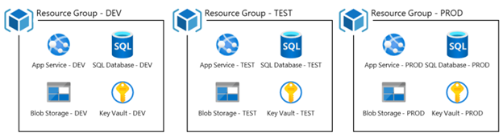
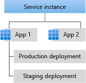

If you are already familiar with Azure Spring Apps concepts and terminology feel free to skip
this module. This page is intended to help developer new to Azure understand some of the common concepts and terms

== Terminolgy and Objects in Azure Spring Apps

Most of the terms here have broad applicability to different Azure services.

=== Subscription

A *Subscription* is a billing entity - it could be a single person or a whole team, but it is who is getting the bill for things created and done in Azure

A subscription can have zero more resource groups. Resource Groups are used to create logical grouping of resources. Usually, they are used to specify a stage in the development cycle (DEV, TEST, PROD). They can also be used to gather up all the resources related to a project or product (such as web tier, middleware, DB, messaging, blob storage…) which are necessary for the project to run. Often the benefits of resource groups are that you can apply actions to everything inside the resource group, such as delete or conversely, prevent accidental deletion.

=== Resource group

*Resource groups* are a higher order resource in Azure. This means you cannot nest Resource groups in resource groups but most entities, except things such as policies or Active Directories, will be in a Resource Group.

=== Services

Resource groups may contain *Services*. The term service is used to describe different things in the Azure system. Typically, it is used to name a resource provided by the Azure platform. For example, Azure App Services, Azure Spring Apps, Azure Functions, Azure Cosmos DB, Azure Blob Storage, and Azure Key Vault are all examples of Azure provided services.

When you create an Azure Spring Apps Enterprise (ASA-E) service, you will need to give it a service name. This means, the term service can refer to either be a pre-defined service from Azure or a user named service hosted in Azure. Usually there is more than one service in the same resource group, especially as part of a microservices “application”.

When you create an instance of a service, you will have to specify the Location, also called *Region*, where it should be created. A location will identify where on the globe you want your services to be hosted. Within a location or region there are *Availability Zones*, which represent redundant data centers for the region. If there are multiple locations in a broad geographic area (such as the East Coast of the United States), the higher the number of the location (East US 2 vs East US) the more recent the creation of that region.

=== Application

*Application* is a container for running your code within an Azure hosting service, such as an ASA-E service or Azure Static Web Hosting service. There can also multiple applications in the same ASA-E service. An application serves as the template for higher level resources for all deployments, such as CPU, allow public URL, liveness probes, persistent storage, and JVM options.

=== Deployment

*Deployments* are how you either create an instance of an Azure provided service or add your code to an ASA-E application. They only contain metadata for the things specific to that deployment and not the application. Examples would be resources like Service Connect. A deployment in Azure Spring Apps Enterprise specifies the code along with all the other settings you want for an instance to run.

There can also be multiple deployments for the same application. An example would be a deployment named “current” which is your currently running production code, and “staging”, which is the code that is staged to replace “current”. Please note, there will be a name for both your deployments and your application. Application name stays constant through different deployments but deployments may be using different names, under the same application, over time.