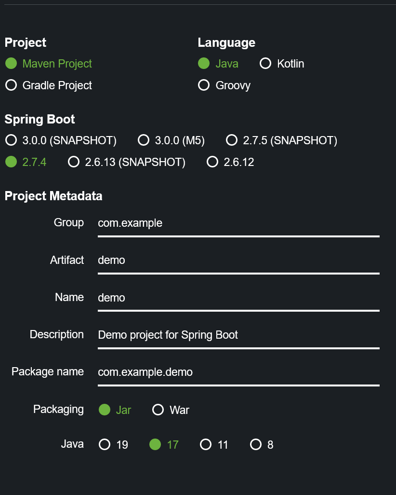

= Creating a local Spring Application

While usually you might go to https://start.spring.io to create new application, we have already added the application code to this coding environment. The application is only using Spring Boot and Spring Web functionality.

== (Optional) Getting the code on your machine
This section's instruction are optional and only if you want to edit the code on your local machine rather than in this learning environment.

Here is the process to create the application on your local machine.
If you are new to Spring, you can learn more of the process in link:spring.io[spring.io]

. Create app on start.spring.io
 Keep all the defaults
 

. Then just add the Spring Web Dependency
 image:images/create-app-dependencies.png[img.png]

After doing that click the "GENERATE" button. This will cause a ZIP file to be downloaded to your machine. Extract this some place on your file system and get ready to edit.

== Editing the code

WARNING: This code is only for ease of teaching and NOT a pattern you should use in real life.

The top directory of the code is demo and it has a typical Maven file layout.

. For the code it will be ugly but also simple so we can focus on ASA-E rather than the code.
+
We need to to edit the file demo/src/main/java/com/example/demo/DemoApplication.java

```editor:open-file
file: ~/exercises/demo/src/main/java/com/example/demo/DemoApplication.java
```

Make the file look like this and save your changes.

```java
 //these need to be added
 import org.springframework.web.bind.annotation.RequestMapping;
 import org.springframework.web.bind.annotation.RestController;

// Add the RestController Annotation
 // This let's us respond at / with a string
 // REMEMBER - this is not a good pattern to use for a normal application
 @RestController
 @SpringBootApplication
 public class DemoApplication {


  public static void main(String[] args) {
     SpringApplication.run(DemoApplication.class, args);
  }

  // Add this whole section which defines what to do when the user requests
  // the base URL of our website.
  @RequestMapping("/")
  public String helloSpring(){
     return "hello spring";
  }


}
```


== Run  our application "locally"

Now we can see the awesomeness that is our new application.
`` mvn spring-boot:run```

See it here:
application-$(session_namespace).$(ingress_domain)

https://docs.educates.dev/custom-resources/workshop-definition.html#defining-additional-ingress-points
https://docs.educates.dev/workshop-content/workshop-instructions.html#passing-of-environment-variables
https://docs.educates.dev/workshop-content/workshop-instructions.html#clickable-actions-for-the-dashboard

Now you should be ready to move your application into Azure Spring Apps.