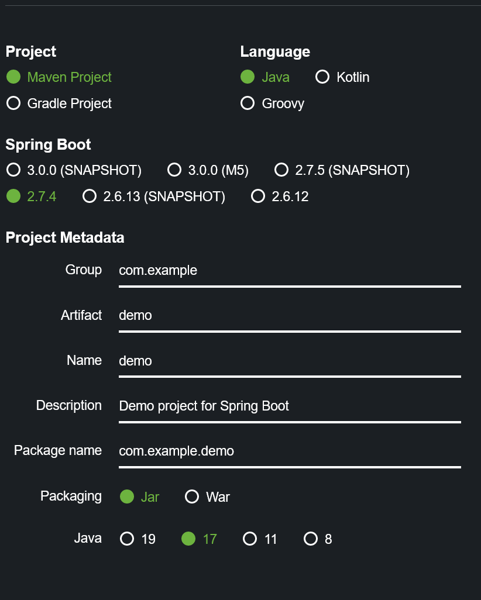
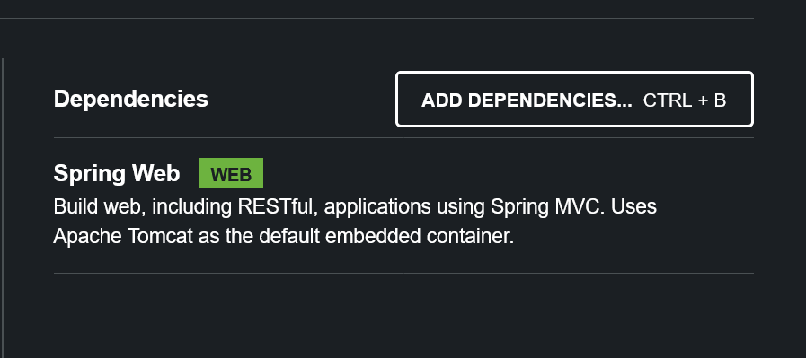

= Deploying to Azure Spring Apps Enterprise (ASA-E)

Up until this point in the tutorial we haven't done anything really worth mentioning (unless you never ran a Spring Boot app before). But with all those
preliminaries complete we can demonstrate the benefits of moving your applications to ASA-E. Let's jump right in with the CLI.

== Logging in and creating our Resource Group

If you forgot the check if you were https://learn.microsoft.com/en-us/cli/azure/reference-index?view=azure-cli-latest#az-login[logged in] or not in an earlier step doing the rest of the workshop requires an authenticaded CLI. Remember we are using "--use-device-code" because, following good security practices, we can not wrap the login page in the Iframe we have here.

[source, bash, role=execute]
----
 az login --use-device-code
----

After executing this command, you should receive a prompt to go to a Microsoft website and enter a code. Clicking the link will open a new browser tab for the URL. You can also just copy the URL and open it in a completely different browser. Once you loging to Azure and enter the code your CLI will be authenticated for the rest of this class. When you finish with this workshop we destroy the machine hosting your workshop and delete any session information. Your password is never shared with us.

Now that you are logged in, the next step is to create a resource group to hold all the work we create today. Remember, resource group is similar to a namespace within your account. Having this created will make it exteremely easy for you to clean up all the Azure resources when we finish. Delete the resource group and everything inside it is deleted. No hunting around for random service or virtual IP floating around still costing you money.

This command will require you to pick a region where your services will be created. We suggest you pick one that is physically closest to you.  The https://stackoverflow.com/questions/44143981/is-there-an-api-to-list-all-azure-regions[following command] lists all the current availability zones:

[source, bash, role=execute]
----
az account list-locations -o table
----

The second column, Name, is the code you want to use in the create region command. Since the author is in California, the example will show West US 2.

[source, bash, role=copy]
----
az group create -l westus2 -n learning
----

This creates a Resource Group in westus2 with a name of playing1. You can use whatever name would you like for your resource group, just make sure to alter the rest of the commands to match your name.

== Creating our ASA-E Service

If you have never created an ASA-E service before, you need to accept the terms of service before continuing:

[source, bash, role=execute]
----
az provider register --namespace Microsoft.SaaS
az term accept --publisher vmware-inc --product azure-spring-cloud-vmware-tanzu-2 --plan asa-ent-hr-mtr
----

With that out of the way we can now create our Azure Spring Apps Enterprise service.

[source, bash, role=copy]
----
az spring create -n first-asa-service -g learning --sku Enterprise
----

Our ASA-E service will be named 'first-asa-service', we want to create in the resource group we just made, and we want to enable the enterprise tier.

NOTE: It can take 15 to 30 minutes to create this service. This command triggers the creation of a cluster of machines. Even if the animated icon stops spinning it is still working on creating the service. You will only need to run this command once and then you can add as many applications as you want to this service (within resource limits)

== Creating and deploying our simple app

=== Creating the application
Now that we have our own ASA-E service spun up we can move our simple app into the service. There are two stages to getting an app into the service

1. First we create the application inside the service. An app is its own resource and can have 1 or more deployments.
+
[source, bash, role=execute]
----
az spring app create -n simpleapp -s first-asa-service -g learning  --assign-endpoint true
----
+
This command creates an app named "simpleapp", in our service, in the learning resource group, and we want the system to give us a public endpoint

=== Deploying the application

Now we package it up on our end and deploy it to the app we created
`az spring app deploy -n springapp --artifact-path target/demo-0.0.1-SNAPSHOT.jar -s the-asa-service -g playing1`

, and we want it to use Java 17.
At the time of writing this workshop, the acceptable runtime versions are Java_8, Java_11, Java_17, and NetCore_3.1 for your

.

1. Login - because we can't open an iframe for the portal
 `az login --use-device-code`
 https://learn.microsoft.com/en-us/cli/azure/reference-index?view=azure-cli-latest#az-login

. ResourceGroup
 `az group create -l westus -n playing1`
 https://learn.microsoft.com/en-us/cli/azure/group?view=azure-cli-latest#az-group-create

. Spring App Service
 `az spring create -n the-asa-service -g playing1 --sku Enterprise  --enable-gateway --enable-api-portal`
 https://learn.microsoft.com/en-us/cli/azure/spring?view=azure-cli-latest#az-spring-create
 Same as spinning up any service in Azure - in this case we are spinning up resources that know how to host Spring, and other language runtimes.
 Enterprise also makes it possible to add frequently used technology, such as an API portal, to the resources spun up.

This is kinda cool to set the defaults so you don't have to keep entereing it.

[source,shell]
----
az configure --defaults \
    group=${RESOURCE_GROUP} \
    location=${REGION} \
    spring=${SPRING_APPS_SERVICE}
----

. Create app on start.spring.io
 Keep all the defaults
 

. Then just add the Spring Web Dependency
 

I think we can avoid all this if we just add this minimal code to the Workshop Image. Then they can avoid start.spring and we can open a page in an editor

. For the code it will be really ugly but also really simple. Make sure to emphasize this is for instructional purposes only and only to demonstrate how to work with ASA-E
[source,java]
----
//these need to be added
import org.springframework.web.bind.annotation.RequestMapping;
import org.springframework.web.bind.annotation.RestController;

// Add the RestController Annotation
// This let's us respond at / with a string
// REMEMBER - this is not a good pattern to use for a normal application
@RestController
@SpringBootApplication
public class DemoApplication {

	public static void main(String[] args) {
		SpringApplication.run(DemoApplication.class, args);
	}

    // Add this whole section which defines what to do when the user requests
    // the base URL of our website.
	@RequestMapping("/")
	public String helloSpring(){
		return "hello spring";
	}

}
----

. Not sure I want them to run it locally - not sure that is important, though it is simple to do
. First create the app with nothing it in
`az spring app create -n springapp -s the-asa-service -g playing1  --assign-endpoint true --cpu 2 --memory 3`
. Now we package it up on our end and deploy it to the app we created
 `az spring app deploy -n springapp --artifact-path target/demo-0.0.1-SNAPSHOT.jar -s the-asa-service -g playing1`

If you area already familiar with Azure Spring Apps concepts and terminology feel free to skip
this module. This page is intended to help developer new to Azure understand some of the common concepts and terms

NOTE FOR AUTHORS The pages are based on this outline
https://onevmw-my.sharepoint.com/:w:/g/personal/spousty_vmware_com/EfM2l_jNwS5ErTm0H_JNpTEByE57Wd-nFMGw3TBDxbMMLw