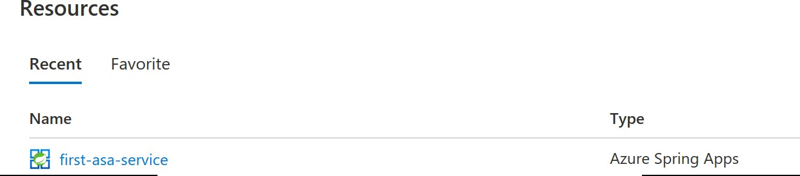
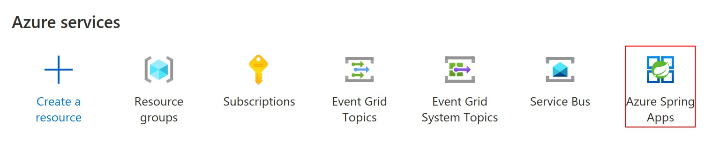
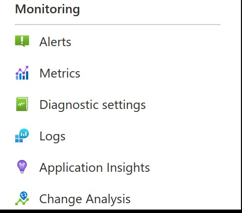
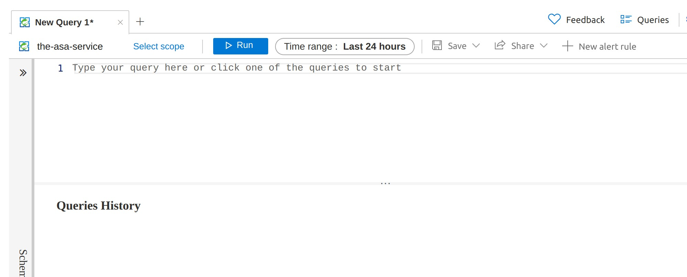
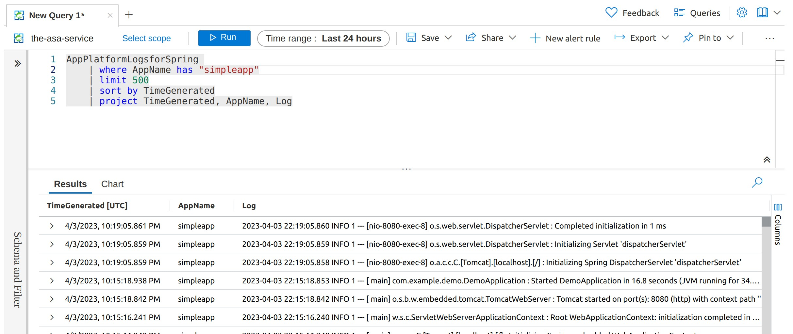
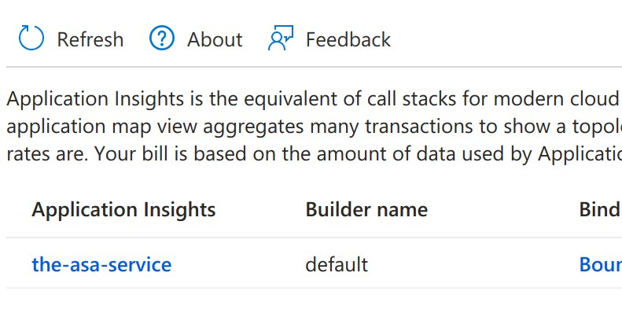
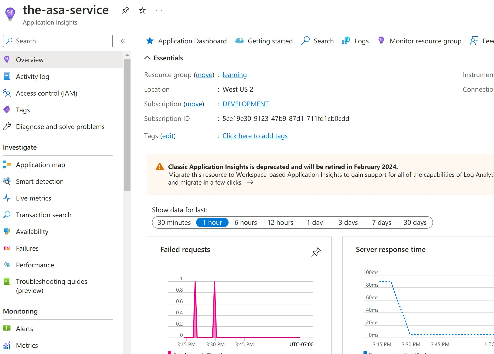

# Logs and Monitoring

Logging and monitoring are key activities you do while developing an app. ASA-E tools provide valuable information as you iterate on your app. In this class we are only going to show the default Azure tools but with Enterprise you can also use [https://docs.vmware.com/en/Application-Live-View-for-VMware-Tanzu/1.1/docs/GUID-index.html](App Live View). All that is required to get more Spring specific metrics is adding [https://docs.spring.io/spring-boot/docs/current/reference/html/actuator.html](Spring Actuator) to your project and then turn it on in your application. Demonstrating how to use this tooling is beyond the scope of this class, but we thought it was important for you to know that feature is available to you.   

We used the CLI for most of the sections before this, but logging and monitoring are activities best done using the web interface.  

## Logging

Streaming the logs from your application is quite easy. Assuming you have set the default region, resource group, and service names on the following page, you just need 

```copy
az spring app logs --name simpleapp --follow
```

You should see logs from the application follow on your screen.

if you would like to see STDOUT showing up in the logs, just add a "System.out.println("xxx")" inside the sayHello method. Re-package and deploy your changes. Deploying your changes will force a break from the logs follow commands. 

Once the app is deployed, restart the follow command and you should see your string appear every time you refresh or load the web page.

If no actions happen on the server, the command will add output to let you know it is still following the logs. You will see:

```shell
 No log from server
```

Given several minutes of inactivity this command will disconnect from the log stream. 

If you want to stop following the logs, just hit CTRL+C to return the shell.

Please note that this command only displays a certain number of lines of pre-connection output and then output moving forward. In our example, we see from the beginning of Spring Boot application being started until the most recent line in the log file. This happens to be all the log output that is available. But, your log had more lines than visible, to see more lines you can add a _-- lines_ flag followed by an integer < 1000. Adding this flag will display the number of lines before the most recent log statement or until the beginning of the file, whichever comes first. 

### Azure Application Logging

Using Azure application logging is more full-featured method to explore your log files. 

If it is not already open, please go ahead and open the [Azure Portal](https://portal.amazon.com) in another tab. Since we auth'ed to enable the CLI, the browser should still have your login information cached. 

We need to navigate to our application to explore logging and monitoring. In the middle of the page, there should be a list of all the resources you have in Azure. One line will contain an Azure Spring Apps icon and the name of the ASA-E service instance you created.



If you don't see your ASA-E service listed there then click on Azure Spring Apps icon along the top with the other services. Once you click this it should bring you to a list which contain your instance of the service.



You should now be looking at the overview of your service. We are not going to explore that today and instead just stay focused on monitoring and logging. On the left nav bar you should a category called monitoring. These views will contain the tools we are about to work with. Let's start with logging by clicking on the Logs item in the list.



## Exploring the logging interface. 

When you click the Logs icon you will be greeted by a catalog of pre-written log queries that are useful for different purposes. These are just suggested starting points, you will be able to change this query or write your own. On the left side of the screen you can skip to different section in the list. This logging interface is common to most Azure services and has its [own documentation](https://learn.microsoft.com/en-us/azure/azure-monitor/logs/data-platform-logs). It would be well worth your time to explore the logging service in depth.

For right now we are just going to learn how to do a simple query and walk through the interface.
When you click on the Logging icon it will bring up a new screen with a modal queries wizard interface. Here you can see starter queries that come out of the box. Since our app does not have any errors or exceptions, we do not need this wizard, go ahead and click the X on the top right of the modal.

You should now be looking at the query interface.


We are going to enter our query in the top box and then click the run button. The lines in the log file matching our query will show up in the bottom half of the screen. 

Remember, we are looking at the logs for the Azure Spring Apps Enterprise service. All the apps running in the service will drain their logs to this location. To see just the logs from  our application enter the following in query text area and click the Run button:
```shell copy
AppPlatformLogsforSpring 
    | where AppName has "YOURAPPNAMEHERE"
    | limit 500
    | sort by TimeGenerated
    | project TimeGenerated, AppName, Log
```

If we had wanted to see the logs from all the applications running in the service, we just modify the query to:

```shell copy
AppPlatformLogsforSpring 
    | limit 500
    | sort by TimeGenerated
    | project TimeGenerated, AppName, Log
```
You should be seeing something like this:



If you want to save the matching lines locally, you can just click the export in the top right area and then choose CSV or your favorite data format. 

This interface is the main way you are going to interact with the logs from your Service and its applications. 

## Monitoring 

The Azure has a powerful and expansive set of tools to monitor your services in Applications. In addition, in Azure Spring Apps Enterprise, you can take advantage of Spring Actuators and their large collection of metrics in the [App Live View interface](https://learn.microsoft.com/en-us/azure/spring-apps/monitor-apps-by-application-live-view). You need to enable Actuators in your application to get the metrics in App Live View. 

Today we are only going to look at the most basic of metrics for our web application. 

In that same far left nav area, this time we are going to click on the Application Insights icon. While there is an icon for metrics, that is focused on building your own custom metrics dashboard. 

Once you click on the Application Insights icon you should see a list of the services appear on the page. Go ahead and click on the name for _the-asa-service_


Now you should see a dashboard with your top metrics listed. Also, on the right side, there are other views and functionality you can bring to your service monitoring. 



Go ahead and play around with the time frame and the items on the left side under the Investigate section on the left side. 

And with that we are having gone through the main ideas for logging and monitoring. As mentioned above, Azure offers a broad and powerful set of tools to help you with monitoring and logging. I highly encourage you to explore this suite of "instant" power you just got!

Let's go ahead and wrap up.

== aliases: []

What capabilities does Azure provide that can help in observing your application.

* _Azure Monitor_ has:
* _Monitor logs_. You need to create a workspace so that then you can forward the logs to it and then go there to analyze logs of your app.
* _Log analytics_. This is where you can get all your logs in an analytical way.
* _Application insights_. This gives you traceability of how your application is being used. Application Performance Monitoring.